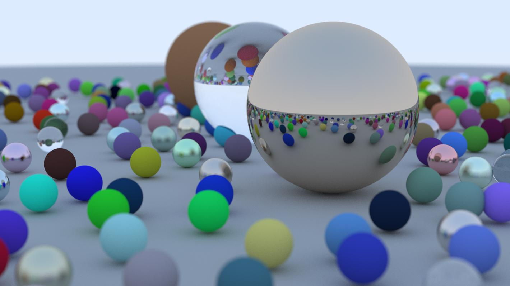

# Ray Tracer

## Overview

This is a C# project by 2 students of the MINI faculty at WUT, inspired by the book "Raytracing in one weekend". 
The project can generate spheres of varying sizes and materials while accurately simulating realistic reflections, light interactions, and surface properties, resulting in highly detailed and visually rich renders.
Below there is an example image generated by this code entirely:
  

## MANUAL: 

- 1: Clone the repository
- 2: Open the project in Visual Studio or other IDE
- 3: Set the project to "Release" mode
- 4: Compile, afterwards your newly created images will appear in the /bin (binaries) directory
 
## Features

- **BVH Acceleration**: Uses a Bounding Volume Hierarchy (BVH) for efficient ray-object intersection testing.
- **Material System**: Supports Lambertian (diffuse), metal (reflective), and dielectric (glass) materials.
- **Antialiasing**: Implements stochastic sampling to smooth out jagged edges.
- **Depth Control**: Adjustable recursion depth for more realistic ray bounces.
- **Defocus Blur**: Simulates camera depth-of-field effects.
- **Parallel Rendering**: Uses multi-threading for faster rendering.

## Usage

The program generates a rendered image of a 3D scene with various spheres placed randomly. The camera settings, material properties, and resolution can be adjusted in `Program.cs` and `Camera.cs`.

### Customizing the Scene

Modify `Program.cs` to:
- Add or remove objects from the world.
- Add and change material properties (diffuse, metal, glass).
- Adjust the camera's position, field of view, and focus.
- Adjust image resolution and aspect ratio.
- Change antialiasing settings (`samplesPerPixel`).
- Modify maximum recursion depth (`maxDepth`).

### Output Format

- The rendered image is saved in `.ppm` format.
- Optionally, the output can be converted to `.jpg`.

